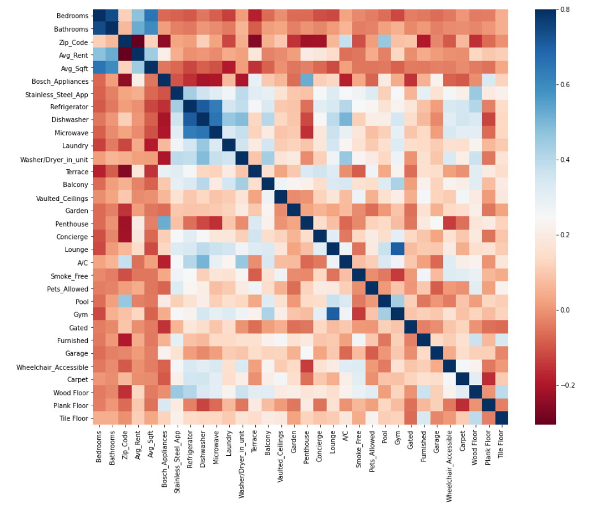

# House Hunter - Estimating Bay Area Rent Prices
<ul>
  <li>Used Selenium to scrape data from over 12,000 apartment listings on apartments.com in the San Jose, Oakland and San Francisco areas  
  <li>Cleaned data and engineered features from text description of apartment amenities by applying NLP techniques to gain insight on what amenities might be useful to include in the final model  
  <li>Created an ML model that estimates rent prices (RMSE ~$365 on test set) given a number of inputs including # of bedrooms, # of bathrooms, square footage and amenities.
</ul>  

# Packages Used and Sources Referenced  
**Python Version:** 3.7  
**Packages:**   
* **Web Scraping:** selenium, pandas, re
* **Data Cleaning/Feature Engineering:** pandas, numpy, re, matplotlib, seaborn, sklearn, nltk
* **EDA/Model Building:** pandas, numpy, matplotlib, seaborn, scipy, sklearn, xgboost    
* **To Install Requirements to Run Pickled ML Model:** `pip install -r requirements.txt`

**Sources Referenced:**
* [Tutorial](https://towardsdatascience.com/selenium-tutorial-scraping-glassdoor-com-in-10-minutes-3d0915c6d905) on scraping Glassdoor using selenium  
* Selenium unofficical [documentation](https://selenium-python.readthedocs.io/)  
* [Guide](https://towardsdatascience.com/productionize-a-machine-learning-model-with-flask-and-heroku-8201260503d2) on productionizing an ML model (used for reference on how to pickle and load an ML model)  

# Data Cleaning & Feature Engineering
* Created 3 new features from address: city, neighborhood and zip code
* Stripped text from numerical features (bedrooms, bathrooms, rent, square footage)
* For listings that had a range for rent and/or square footage, converted the range into an average
* Applied NLP techniques (bag of words) and fit a random forest regression model using just the bedroom size and raw text from the amenities column to gain insight on features that may be useful to extract from the amenities text

### Feature Importances from NLP Model

  

# Exploratory Data Analysis
Performed more feature engineering during my exploratory data analysis:
* Removed some of the outliers (some rent prices were $15,000+)
* Chose to drop neighborhood feature and use only zip codes and cities
* Consolidated cities that appeared less frequently into an “Other” category
* Consolidated zip codes that appeared less frequently into a “City Name - Other” category
* Created dummy variables for categorical features
* Took natural log of rent and square footage columns to address positive skewness observed in distributions
* Dropped some of the amenities features that were infrequent, unclear or less impactful 

 

 

  

  

# Model Building
Compared 4 different models and evaluated performance on validation set:
* Multiple Linear Regression
* Support Vector Machine
* Random Forest
* XGBoost

  

  

# Choosing Final Model (Random Forest)
After tuning hyperparameters, the final random forest model achieved the following results on the test set:  
    
**Root Mean Square Error:** 364.64 (in dollars)   
**R2 Score:** 0.896   
**Adjusted R2 Score:** 0.895   

   

### Features Importances for Final Random Forest Model

    

